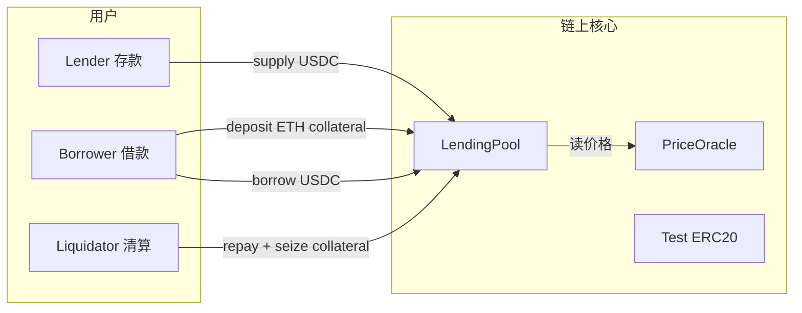

# Ark-Lend MVP 学习方案

> 借贷 + 清算 DeFi MVP，以学习为目的。单池、单抵押品、单借款资产，跑通完整链上闭环。

---

## 一、MVP 目标

**单池、单抵押品、单借款资产**：用户存 USDC 赚利息 → 用户抵押 ETH 借 USDC → 价格下跌后可被清算 → 清算人获得奖励。

跑通这条链上闭环，比堆功能更重要。

---

## 二、核心架构



| 模块 | 职责 | MVP 简化 |
|------|------|----------|
| **LendingPool** | 存款、借款、还款、清算、计息 | 一个池子搞定 |
| **PriceOracle** | 抵押品/借款资产价格 | 管理员手动设价，或 Chainlink mock |
| **Mock ERC20** | USDC（6 位）、WETH（18 位） | 测试网水龙头 mint |
| **（可选）InterestRateModel** | 利用率 → 利率 | 可先写死在 Pool 里 |

---

## 三、必须做的功能（MVP 范围）

### 1. 存款 / 取款（Supply / Withdraw）

- 用户存入 USDC，获得 **份额 token**（类似 aToken，或内部 `shares` 记账）
- 按 **利用率** 产生简单利息（例如：利用率越高，存款利率和借款利率越高）
- 测试：存 → 等几个 block → 取，余额变多

### 2. 抵押与借款（Deposit / Borrow）

- 用户存入 ETH 作为抵押
- 按 **LTV（Loan-to-Value）** 借出 USDC，例如 LTV = 70%
- 记录每个用户的：`collateral`、`debt`
- 测试：抵押 1 ETH @ $2000 → 最多借 ~$1400 USDC

### 3. 健康因子 / 可清算判断

定义：

$$\text{Health Factor} = \frac{\text{抵押品价值} \times \text{清算阈值}}{\text{债务价值}}$$

- 例如清算阈值 80%，HF < 1 时可清算
- **view 函数** `getHealthFactor(user)` — 前端和测试都会用到

### 4. 清算（Liquidation）

- 任何人可调用：替借款人还一部分/全部债务
- 获得 **折价抵押品** 作为奖励（例如 5% bonus）
- 测试用例要覆盖：
  - 价格跌 → HF < 1 → 清算成功
  - HF ≥ 1 → revert
  - 清算后借款人债务减少、清算人拿到 ETH

### 5. 还款（Repay）

- 借款人还 USDC，释放可提取的抵押品额度

### 6. 价格预言机（极简版）

- **学习阶段推荐**：`owner` 调用 `setPrice(asset, price)` 手动改价
- 用来模拟「ETH 暴跌触发清算」，比接 Chainlink 更直观
- 后续再加 Chainlink 或 Pyth

### 7. Foundry 测试（比前端更重要）

至少写这些测试：

- 正常存借还流程
- 抵押不足时 borrow revert
- 手动降价 → 清算 → 清算人获利
- 利息随时间累积（`vm.warp`）
- 边界：还清债务后可取回全部抵押

### 8. 部署脚本

- `script/Deploy.s.sol`：部署 Mock USDC、Mock WETH、Oracle、Pool
- 本地 anvil + 测试网（Sepolia）二选一即可

---

## 四、建议做但可极简的东西

| 项目 | 极简做法 |
|------|----------|
| **前端** | 只用 React + wagmi/viem，4 个页面：Supply / Borrow / Repay / Liquidate |
| **利率模型** | 线性：`borrowRate = base + utilization * slope` |
| **份额会计** | `shares = amount * totalShares / totalAssets`，不必单独 ERC20 |
| **事件 Event** | `Supply`, `Borrow`, `Repay`, `Liquidate` — 方便前端和调试 |

---

## 五、明确不要做的（MVP 阶段砍掉）

| 不要做 | 原因 |
|--------|------|
| 多资产、多池、跨池 | 状态机和会计复杂度 ×10 |
| eMode、隔离模式、风险参数治理 | 治理 + 风控，非 MVP |
| Flash Loan | 独立安全模型 |
| 拍卖式清算 / Dutch auction | 先做固定折扣清算即可 |
| 真实 Chainlink 作为主路径 | 测试网喂价不稳定；先 manual oracle |
| 升级代理（UUPS/Transparent） | 先 immutable 或 owner 简单合约 |
| 权限治理（Timelock、多签） | `onlyOwner` 够用 |
| 利率曲线优化、IR 曲线拟合 | 固定公式即可 |
| Subgraph / 索引服务 | 直接读合约 + events |
| 审计、赏金、形式化验证 | 学习项目不需要 |
| 多链部署 | 单链（anvil 或 Sepolia） |
| 合规 KYC / 许可池 | 完全 out of scope |

---

## 六、关键参数（写死在合约或部署脚本里）

```solidity
// 示例，可按需调整
LTV = 70%                      // 最大借款比例
Liquidation Threshold = 80%    // 清算线（比 LTV 高，留缓冲）
Liquidation Bonus = 5%           // 清算人折扣奖励
Reserve Factor = 10%             // 协议抽成（可先 0%）
```

学习重点：**为什么 LTV < Liquidation Threshold** —— 给价格波动留安全边际。

---

## 七、技术栈

- **合约**：Solidity 0.8.x + Foundry
- **依赖**：OpenZeppelin `ERC20`、`ReentrancyGuard`（抵押品用 `WETH` 或原生 ETH wrapper）
- **测试**：`forge test` + `vm.prank` / `vm.warp`
- **本地链**：`anvil`
- **前端（可选）**：Next.js + wagmi + viem
- **不用**：Hardhat、The Graph、复杂 monorepo

---

## 八、推荐目录结构

```
contracts/
├── src/
│   ├── tokens/MockERC20.sol
│   ├── oracle/SimpleOracle.sol
│   ├── pool/LendingPool.sol
│   └── interfaces/ILendingPool.sol
├── test/
│   └── LendingPool.t.sol      # 一个文件覆盖主流程即可
└── script/
    └── Deploy.s.sol
```

---

## 九、学习产出 Checklist

做完 MVP 你应该能讲清楚：

1. 份额型存款（exchange rate）怎么算
2. 利用率如何驱动利率
3. Health Factor 公式及每个参数含义
4. 清算时谁付钱、谁拿抵押品、协议有没有坏账
5. 重入、oracle 操纵、精度（6 vs 18 decimals）等基础风险点

---

## 十、总结：做 vs 不做

| 做 | 不做 |
|----|------|
| 单池 ETH/USDC | 多资产矩阵 |
| 存、借、还、清算 | Flash loan、治理 |
| Manual Oracle | 生产级预言机集成 |
| Foundry 完整测试 | Subgraph |
| 可选极简前端 | 精美 DeFi UI |
| 固定利率模型 | 复杂 IR 曲线 |

---

# 手写代码学习路线

> 借贷和清算不是「看懂接口」就能内化的事——你要亲手处理 **记账、价格、权限、精度、状态先后**，才会真正理解。

---

## 学习原则

1. **一次只加一个能力**，每步都 `forge test` 全绿再往下走
2. **先写测试再写实现**（或至少同步写），用测试逼自己想清楚状态
3. **先 manual oracle**，用 `setPrice` 模拟暴跌，清算最好理解
4. **不要抄 Aave 源码**，先写「能跑的最丑版本」，再重构

---

## Phase 0：准备（半天）

删掉或忽略 `Counter`，新建：

- `MockERC20.sol` — USDC（6 decimals）、WETH（18 decimals）
- `SimpleOracle.sol` — `mapping(address => uint256) price` + `onlyOwner setPrice`

价格建议统一用 **8 位小数**（和 Chainlink 习惯一致），例如 ETH = `2000e8`。

**自测**：mint token、setPrice、读价格。

---

## Phase 1：存款（理解「份额」）

### 你要写的

`LendingPool.supply(usdcAmount)` / `withdraw(usdcAmount)`

### 核心心智模型

池子里 USDC 会变多（别人借走），但 **份额（shares）** 代表你在池子里的比例：

```
sharesToMint = amount * totalShares / totalAssets   // 首次 supply 时 totalShares=0，1:1
assetsToReturn = shares * totalAssets / totalShares
```

`totalAssets` = 池内实际 USDC + 别人欠的债（后面借出后才需要这一项）。

### 这一步先不要

- 利息
- 借款

### 过关标准

- Alice supply 1000 → withdraw 1000，分文不少
- Alice supply 1000，Bob supply 1000，Alice withdraw 一半，拿 500

---

## Phase 2：借款（理解「抵押 + LTV」）

### 你要写的

```
depositCollateral(ethAmount)   // 用户转 WETH 进池子
borrow(usdcAmount)             // 检查 LTV 后转出 USDC
```

### 核心心智模型

每个用户一份账本：

```solidity
struct Position {
    uint256 collateral;  // WETH 数量
    uint256 debt;        // USDC 数量（先不计利息）
}
```

借款前检查：

```
collateralValue = collateral * ethPrice / 1e18
maxBorrow       = collateralValue * LTV / 100
require(debt + newBorrow <= maxBorrow)
```

同时：`totalAssets` 要减去借出的 USDC（池子可借余额变少）。

### 过关标准

- 抵押 1 ETH @ $2000，LTV 70% → 最多借 1400 USDC
- 借 1500 → revert
- 池子 USDC 不够时 → revert

---

## Phase 3：还款（理解「债务 ↓ → 可提抵押 ↑」）

### 你要写的

`repay(usdcAmount)` — 用户转 USDC 进来，`position.debt -= amount`

可选：`withdrawCollateral(ethAmount)` — 还完或还到足够低后，才能提抵押品（再次检查 LTV）。

### 核心心智模型

还款不改变别人份额，只是：**债务减少 → 池子 USDC 回来 → 借款人可释放抵押品**。

### 过关标准

- 借 1000 → 还 1000 → debt = 0 → 可提回全部 ETH
- 只还 500 → 只能提一部分 ETH（仍满足 LTV）

---

## Phase 4：健康因子（清算的前置）

### 你要写的

`getHealthFactor(user) view returns (uint256)`

### 公式（建议先写死参数）

```
collateralValue = collateral * ethPrice / 1e18
debtValue       = debt * usdcPrice / 1e6   // USDC 价可固定 1e8

HF = collateralValue * liquidationThreshold / debtValue
```

`liquidationThreshold` 例如 80%（8000 bps）。  
HF 用 1e18 缩放：`HF < 1e18` 表示可清算。

### 过关标准

- 抵押 1 ETH，借 1400 USDC，ETH 跌到 $1600 以下 → HF < 1
- 用 `oracle.setPrice` 手动降价，在测试里验证

---

## Phase 5：清算（核心中的核心）

### 你要写的

`liquidate(borrower, debtToCover)` 或 `liquidate(borrower)` 一次清掉部分债务

### 清算在链上实际发生什么

```
1. 清算人转 USDC 进来（替借款人还债）
2. borrower.debt -= debtToCover
3. 按折扣把 ETH 转给清算人（liquidation bonus）
4. borrower.collateral -= seizedEth
```

**抵押品 seize 数量**（典型写法）：

```
// 清算人偿还 debtToCover 的 USDC，应获得价值更高的 ETH
seizedValue = debtToCover * (100% + bonus)   // 例如 bonus = 5%
seizedEth   = seizedValue * 1e18 / ethPrice
```

### 你要想清楚的 3 个问题

1. **谁付钱？** 清算人掏 USDC
2. **谁拿钱？** 清算人拿折价 ETH（bonus 是给他的利润）
3. **协议亏不亏？** MVP 里通常不亏；若 bonus 设太高 + oracle 不准，可能出问题

### 过关标准（建议写成 3 个 test）

| 测试 | 预期 |
|------|------|
| HF ≥ 1 时清算 | revert |
| 价格跌、HF < 1 | 清算成功，借款人 debt 减少 |
| 清算人余额 | USDC 减少、WETH 增加，且 WETH 价值 > 付出的 USDC |

---

## Phase 6：利息（最后加）

借款人的 `debt` 随时间增长，存款人的 `totalAssets` 随之增长。

MVP 极简做法：

- 全局 `borrowIndex`，每次 borrow/repay/liquidate 时 `accrueInterest()`
- `debt = principal * borrowIndex / userIndex`

或更简单：**固定年化**，只在关键操作时按 `block.timestamp` 差算一次。

先跑通无利息的清算，再加利息，避免一次 debug 两个系统。

---

## 手敲顺序一览

| 顺序 | 函数 | 搞懂什么 |
|------|------|----------|
| 1 | `supply` / `withdraw` | 份额、池子总资产 |
| 2 | `depositCollateral` | 用户抵押记账 |
| 3 | `borrow` | LTV、池子流动性 |
| 4 | `repay` | 债务与抵押释放 |
| 5 | `getHealthFactor` | 价格风险 |
| 6 | `liquidate` | 清算闭环 |
| 7 | `accrueInterest` | 时间维度 |

---

## 推荐实现节奏（4 周）

```
Week 1: Mock tokens + Oracle + 存款/取款 + 份额计息
Week 2: 抵押 + 借款 + 还款 + HF 计算
Week 3: 清算逻辑 + 完整 Foundry 测试
Week 4: 部署脚本 + 简陋前端（或只写 integration test）
```

每周验收标准：**`forge test` 全绿 + 能在 anvil 上手动走一遍流程**。

---

## 写的时候最容易卡住的点

1. **精度**：USDC 6 位、ETH 18 位、价格 8 位 — 先定一套换算，写注释
2. **先 accrue 再改状态**：borrow/repay/liquidate 前先更新利息
3. **清算 bonus**：用 USDC 计价算应 seize 多少 ETH，方向别反
4. **totalAssets**：借出后池子现金变少，但「应收债务」算在资产里
5. **Reentrancy**：涉及 `transfer` 的函数加 `nonReentrant`

---

## 最小测试模板

```solidity
function test_liquidation_happyPath() public {
    // 1. 准备：LP supply 10000 USDC，借款人抵押 1 ETH
    // 2. 借 1400 USDC
    // 3. oracle.setPrice(ETH, 1500e8)  // 暴跌
    // 4. assertLt(pool.getHealthFactor(borrower), 1e18)
    // 5. liquidator 清算
    // 6. assertGt(liquidatorWethBalance, 0)
    // 7. assertLt(pool.debt(borrower), 1400e6)
}
```

---

## 内化路径总结

```
Supply（份额）→ Borrow（LTV）→ Repay（债务）→ 降价（HF）→ Liquidate（付钱拿抵押）
```

每步只加一个概念，用测试钉死行为。比一次性抄一个大合约有效得多。
